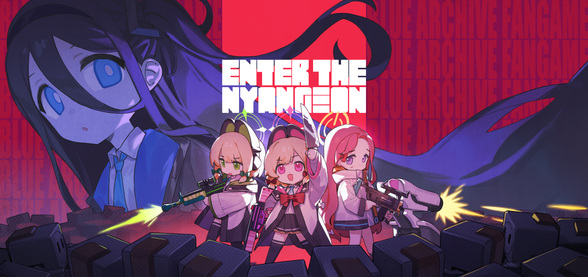

# 挺进喵牢 · Enter The Nyangeon

在爱丽丝被网络 MEME 侵蚀的数据地牢中，带领数字化的学生们战斗到最后。

**《挺进喵牢》是一款由 SH 独立开发的《蔚蓝档案》非官方同人游戏，结合了 2D 俯视角竞技场射击与轻度 Roguelike 构筑。** 在一轮轮战斗中收集硬币、获取藏品、搭配角色与支援，迎战敌人与 Boss。

[下载游戏](https://shinh.itch.io/enter-the-nyangeon) · [Mod 开发指南](mod_sdk/README.md) · [项目地图](docs/PROJECT_MAP.md) · [作者 BiliBili](https://space.bilibili.com/488279)

## 开始游玩

前往 [itch.io 发布页](https://shinh.itch.io/enter-the-nyangeon) 下载 **Windows** 或 **Android** 版本，查看更新日志并反馈游玩体验。发布包与本仓库的开发进度可能不同，下载版本以发布页为准。

- **角色与支援**：选择学生出战，搭配支援角色的被动与 EX 技能。
- **回合构筑**：在战斗中收集硬币，于回合间获取藏品与升级，逐步形成自己的搭配。
- **竞技场挑战**：应对敌人波次与 Boss，挑战不同难度和游戏模式。
- **语言支持**：内置简体中文、英语、葡萄牙语和越南语，可在游戏内切换。

操作说明可在游戏设置中查看。安装 Mod 时，在设置的 **MOD** 管理页导入 Mod 的 `.zip` 包，然后重启游戏使其生效；包格式和安装位置见 [Mod SDK](mod_sdk/README.md)。

## 从源码运行

项目使用 **Godot 4.7 / GDScript**，配置为 **Forward Plus** 渲染器，2D 物理由 **Rapier2D** 提供。Rapier2D 扩展及其原生库已包含在仓库中；扩展声明的最低 Godot 版本为 4.7。

1. 克隆或下载本仓库，准备与项目一致的 Godot 4.7 编辑器。
2. **首次导入前，检查下面的编辑器辅助插件配置。**
3. 在 Godot 项目管理器中导入根目录的 `project.godot`，等待资源导入完成。
4. 按 **F5** 运行项目，入口为 `scenes/main/title_screen.tscn`。

### 缺少 `godot_ai` 时

`addons/godot_ai/` 是本地编辑器 MCP 辅助插件，已被 Git 忽略。当前 `project.godot` 仍保留其插件和 autoload 配置，干净克隆后可能出现缺失文件报错。

若本地没有该插件，请在 **Godot 编辑器关闭时**编辑 `project.godot`：

- 从 `[autoload]` 中删除以下一行：

  ```ini
  _mcp_game_helper="*res://addons/godot_ai/runtime/game_helper.gd"
  ```

- 从 `[editor_plugins]` 的 `enabled` 中移除 `res://addons/godot_ai/plugin.cfg`。当前列表仅含此插件，移除后为：

  ```ini
  [editor_plugins]

  enabled=PackedStringArray()
  ```

此外，在本地 `tests/` 目录中创建一个空的 `.gdignore` 文件，让 Godot 跳过依赖 `McpTestSuite` 的测试脚本，避免缺少插件基类时的解析报错。该忽略文件仅用于本地无插件环境；配置好插件、需要运行测试时，应删除它并重新扫描资源。

保存后再导入项目。该辅助插件不属于游戏逻辑；仓库中的 MCP 测试套件则需要配置此插件后才能运行。

## 开发 Mod

游戏通过 `ModManager` 加载 Mod，提供内容注册、补丁、翻译与运行时扩展接口。可扩展角色、升级藏品、敌人、支援、服装、游戏模式和关卡。

| 目标 | 从这里开始 |
| --- | --- |
| 了解包格式、接口与打包安装流程 | [Mod SDK](mod_sdk/README.md) |
| 制作角色 Mod | [角色制作指南](mod_sdk/CHARACTER_GUIDE.md) |
| 从最小示例入手 | [示例 Mod](mod_sdk/example_mod/README.md) |
| 开发或构建联机 Mod | [ETN Coop Mod](mod_sdk/coop_mod/README.md) |
| 验证 Windows / Android 导出后的 Mod 行为 | [Mod 导出与真机验证](docs/MOD_TESTING.md) |

普通内容 Mod 使用独立的本体工程副本制作和打包，具体命令见 SDK。`mod_sdk/` 带有 `.gdignore`，不会被 Godot 导入或随本体导出。

**联机由独立的 ETN Coop Mod 提供**，需单独构建或安装。它包含 LAN 与 WebSocket 中继传输支持；跨网中继需要另行部署服务端，源码随 SDK 附带，见 [`relay_server.py`](mod_sdk/coop_mod/server/relay_server.py)。兼容要求、服务端启动与使用方式以 [Coop 文档](mod_sdk/coop_mod/README.md) 为准。

## 维护项目

### 目录导航

| 路径 | 内容 |
| --- | --- |
| `scenes/` | 战斗场景、玩家、敌人、武器、道具与管理器 |
| `script/` | 全局单例、实体基类与共享逻辑 |
| `resources/` | 角色、装备、Buff、关卡等数据资源 |
| `ui/` | 菜单、HUD、卡片和界面资源 |
| `sprites/`、`sounds/`、`fonts/`、`shaders/` | 贴图、音频、字体与着色器 |
| `ETN_*localization.csv` | 本地化源文件及配套生成的翻译资源 |
| `addons/godot-rapier2d/` | Rapier2D 物理扩展 |
| `mod_sdk/` | Mod SDK、示例与构建脚本 |
| `tests/` | 依赖 `godot_ai` 的 MCP 测试套件 |
| `docs/` | 项目知识库与验证说明 |

### 阅读与修改

开始修改前，先阅读 [AGENTS.md](AGENTS.md) 和对应主题文档：

| 文档 | 内容 |
| --- | --- |
| [项目地图](docs/PROJECT_MAP.md) | 目录职责、场景与脚本配对、主流程入口 |
| [运行时架构](docs/ARCHITECTURE.md) | autoload、信号总线、对象池、存档和场景切换 |
| [系统说明](docs/SYSTEMS.md) | 战斗、Buff、资源数据、实体与回合流程 |
| [项目约定](docs/CONVENTIONS.md) | 命名、本地化、输入、物理层和资源规范 |
| [经验库](docs/LEARNINGS.md) | 已知问题、隐式耦合与排查经验 |

结构或逻辑变更完成后，同步更新对应文档。本地化 CSV 必须保留 **UTF-8 BOM / CRLF**，新条目追加到末尾，并在 Godot 中重新导入以生成 `.translation` 文件。提交信息遵循 Conventional Commits，描述可使用中文。

### 排查与反馈

反馈问题时，请附上游戏版本、平台、启用的 Mod、复现步骤，以及预期和实际表现；画面问题可补充截图或录屏。

项目启用了文件日志，路径为 `user://logs/ETN_debug.log`。Windows 默认位置：

```text
%APPDATA%\Godot\app_userdata\Enter The Nyangeon\logs\ETN_debug.log
```

源码中的版本标识见 [`script/Game.gd`](script/Game.gd) 的 `version_number`；发布版本和更新说明见 [itch.io](https://shinh.itch.io/enter-the-nyangeon)。

## 制作与鸣谢

- **制作**：SH · [BiliBili](https://space.bilibili.com/488279) · [X](https://x.com/shinsssh)
- **音乐来源**：NEXON - BlueArchive；游戏使用了部分官方音乐与语音素材。
- **联机特别感谢**：荻某人 · [BiliBili](https://space.bilibili.com/404380192)
- **葡萄牙语翻译**：Filipe · [X](https://x.com/_Filipe1704_)
- **越南语翻译**：KingLancer2204

本项目为《蔚蓝档案》非官方同人作品，相关角色、音乐、语音等原作素材的权利归各自权利方所有。仓库目前未附带项目级 `LICENSE`；Rapier2D 的 MIT 许可证见 [第三方组件 LICENSE](addons/godot-rapier2d/LICENSE)。
